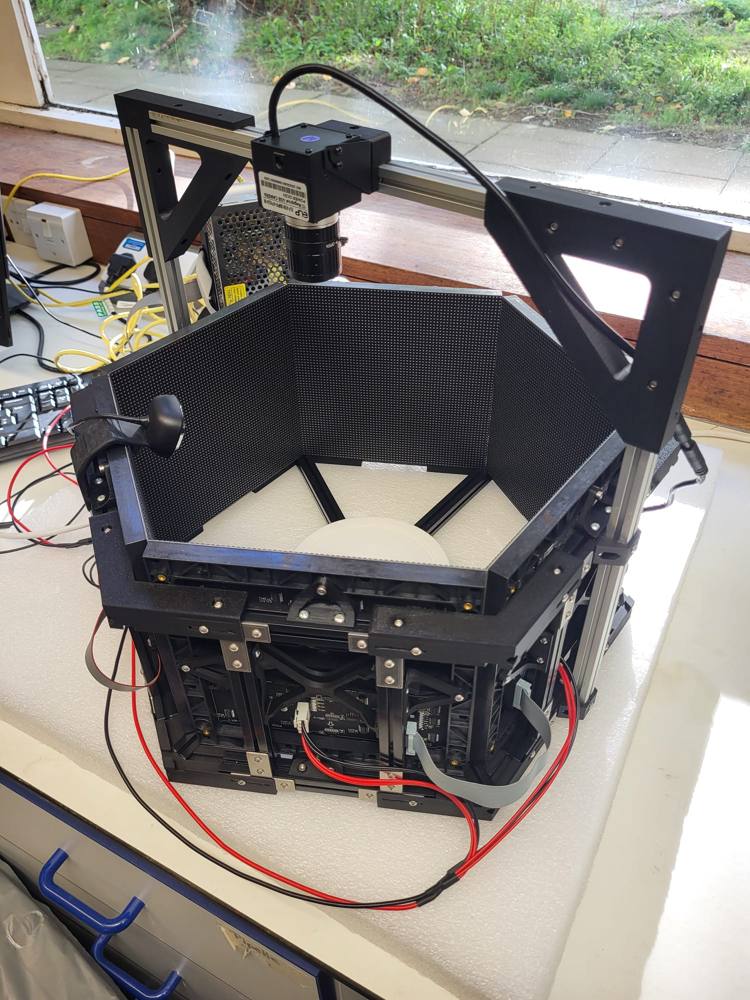
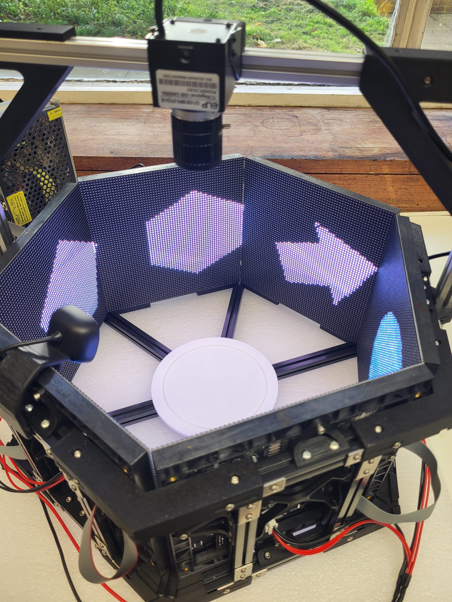

# Buridan paradigm

This project has created open source hardware to perform experiments in a "Buridan paradigm"

First described in 1980 by Goetz [reference](https://pubmed.ncbi.nlm.nih.gov/6779803/) in a visual discrimination context for Drosophila melanogaster, the Buridan Paradigm follows from "buridan's ass" where a hypotetical donkey would die of starvation and thirst if placed at the same distance from a water and a food source, being equally thirsty and hungry. For the experiment using Drosophila, an animal without flying capabilities is placed in an arena, where it is free to walk. Outside of the arena, visual stimuli can be presented, and the movement of the animal towards, or away from these stimuli are recorded and measured.

This implementation of this paradigm relies on commercially available RGB LED Matrices (64x64 leds, with 3mm pitch) and the excellent control library https://github.com/hzeller/rpi-rgb-led-matrix. The system is controlled by a raspberry pi, and it is mechanically put together with Makerbeams, 3D printed parts, screws and nuts. An USB ELP Camera records the fly movement from above. Software was developed in collaboration with [BFKLAB](https://www.bfklab.com/)

Currently (Jan 2026) the system is being tested in the laboratory of [Prof. Sugie](https://www.bri.niigata-u.ac.jp/~neuroscience_disease_sugie/lab/en/) at the Niigata University in Japan 

Researchers and enthusiasts interested in replicating the system can get in touch with [Andre](andremchagas@proton.me)

---

### Academic references

- https://pubmed.ncbi.nlm.nih.gov/6779803/ - Visual Guidance in Drosophila

### Related hardware components, software, etc

#### LED panels:

- https://elifesciences.org/articles/63355
- https://www.sciencedirect.com/science/article/pii/S096098220800167X
- https://reiserlab.github.io/Modular-LED-Display/

#### Webcams:

- ELP non-IR (high frame rate - up to 250): https://www.amazon.co.uk/ELP-5-50mm-Computer-Comference-Raspberry/dp/B08Y5SG1BF/
- ELP IR: (frame rate up to 60): https://www.amazon.co.uk/ELP-KL36IR-Webcam-Infrared-Camera/dp/B07G56VVYR

#### supporting frames:

- MakerbeamXL: https://www.makerbeam.com/makerbeamxl/

#### RGB matrix driving systems:

- https://github.com/hzeller/rpi-rgb-led-matrix
- https://learn.lushaylabs.com/led-panel-hub75/
